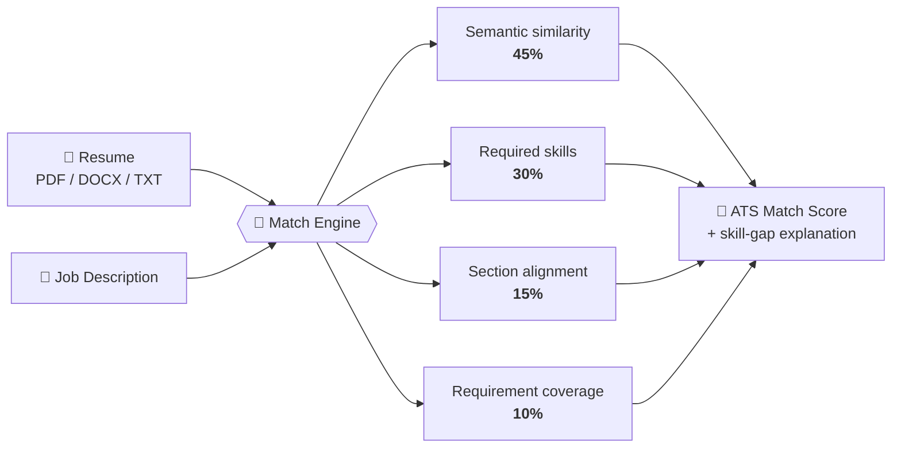
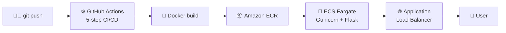
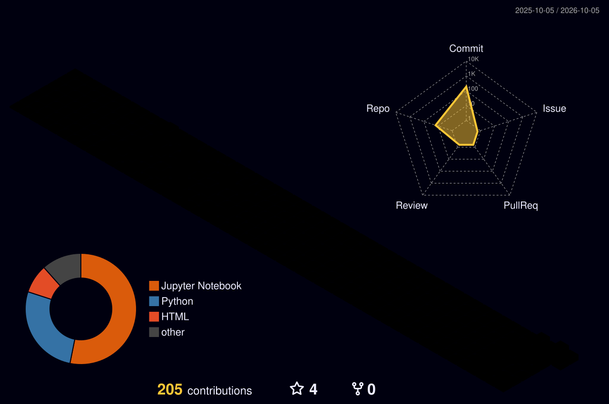

<!-- ═══════════════ 3D WAVE HEADER ═══════════════ -->
<div align="center">


<a href="https://git.io/typing-svg">
  
</a>

<br/>

[](https://itskunalkumar.github.io/)
[](https://www.linkedin.com/in/kunalbtech2024)
[](mailto:kunalbtech2024@gmail.com)


</div>

---

## 👨‍💻 About Me

> *"I replace **'I think'** with **'the data shows.'**"*

I'm a **Data Analyst and Data Science & Machine Learning practitioner** with a Mechanical Engineering background. I work with **SQL, Power BI, Python (Pandas, NumPy, Scikit-learn)** and **Advanced Excel**, and I build **end-to-end ML/DL projects** that are deployed and live, using **TensorFlow/Keras, NLP, Flask, FastAPI, Docker, AWS ECS and CI/CD**.

```python
class Kunal:
    role      = ["Data Analyst", "Data Scientist", "ML Engineer"]
    education = "B.Tech Mechanical Engineering, Bihar Engineering University"
    focus     = ["Fraud Detection", "NLP", "Computer Vision", "MLOps"]
    achieved  = "Smart India Hackathon 2023 Finalist 🏆"

    def goal(self):
        return "Turn data into decisions that matter."
```

---

## 📈 Impact at a Glance

<div align="center">

| 🔍 **5% → 51%** | 💳 **100,000+** | 🧠 **6+** | 🌐 **5** |
|:---:|:---:|:---:|:---:|
| fraud recall improvement | transactions scored | fraud models evaluated | ML apps deployed live |

| 🎯 **90.5%** | ⚡ **~1 sec** | 📚 **100,000** | 🗂️ **113** |
|:---:|:---:|:---:|:---:|
| leaf-disease validation accuracy | prediction time on CPU | sentence pairs for translation | skills in the ResuMatch taxonomy |

</div>

---

## 💼 Experience

<table>
<tr>
<td width="50%" valign="top">

### 🏢 Data Science & Analyst Intern
**Amdox Technologies** · *Nov 2025 – Feb 2026*

- Designed and evaluated **6+ fraud detection models**: Logistic Regression, XGBoost, Isolation Forest, One-Class SVM, Autoencoder, graph-based
- Raised **fraud recall from 5% to 51%** by tuning XGBoost with RandomizedSearchCV
- Built a **serialized real-time scoring pipeline** and logged **100,000+ scored transactions** for monitoring

</td>
<td width="50%" valign="top">

### 🏢 Intern, Language Translation using Neural Networks
**Infosys Springboard** · *Feb 2025 – Apr 2025*

- Built an **English-to-Hindi NMT** system with a custom **Encoder–Decoder Transformer** in TensorFlow/Keras
- Trained on **100,000 sentence pairs** (IITB corpus) with a **16,000-token SentencePiece BPE** vocabulary
- Implemented the full pipeline: preprocessing, tokenization, training and autoregressive decoding

</td>
</tr>
</table>

---

## 🚀 Featured Projects

<div align="center">

*Hover over a card, then click it to open the project.*

</div>

<table>
<tr>
<td width="33%" valign="top" align="center">

<a href="https://github.com/itskunalkumar/Resume-Intelligence-Engine"></a>

Explainable resume matching with **Sentence-BERT**, a 113-skill taxonomy and a **FastAPI** service.

[](https://github.com/itskunalkumar/Resume-Intelligence-Engine) [](https://resume-intelligence-engine-production-e954.up.railway.app)

</td>
<td width="33%" valign="top" align="center">

<a href="https://github.com/itskunalkumar/Leaf-Disease-Prediction"></a>

Fine-tuned **InceptionV3** that detects crop leaf diseases and suggests treatment in about a second.

[](https://github.com/itskunalkumar/Leaf-Disease-Prediction) [](https://leaf-disease-prediction-gt.streamlit.app)

</td>
<td width="33%" valign="top" align="center">

<a href="https://github.com/itskunalkumar/End-To-End-ML-Project"></a>

Modular ML pipeline deployed on **AWS ECS Fargate** with automated **CI/CD**.

[](https://github.com/itskunalkumar/End-To-End-ML-Project) [](http://student-performance-alb-1284440920.ap-south-1.elb.amazonaws.com/)

</td>
</tr>
</table>

<div align="center">

<table>
<tr>
<td width="33%" valign="top" align="center">

<a href="https://github.com/itskunalkumar/AI-CyberShield"></a>

ML security system for grid-connected microgrids: two-signal detection (**XGBoost + Isolation Forest**), **SHAP** explanations and a fail-safe risk policy. A research prototype on a single dataset.

[](https://github.com/itskunalkumar/AI-CyberShield) [](http://ai-cybershield-alb-870998626.ap-south-1.elb.amazonaws.com/)

</td>
<td width="33%" valign="top" align="center">

<a href="https://github.com/itskunalkumar/Mechanical-Parts-Defect-Detection"></a>

Deep-learning quality control that classifies casting parts as OK or defective with **MobileNetV2**, **Grad-CAM** heatmaps, a REST API and a monitoring dashboard.

[](https://github.com/itskunalkumar/Mechanical-Parts-Defect-Detection) [](https://defect-detection-5e9g.onrender.com/)

</td>
</tr>
</table>

</div>

<div align="center">

[](https://github.com/itskunalkumar?tab=repositories)

</div>

<details>
<summary><b>🧩 How ResuMatch scores a resume (click to expand)</b></summary>

<br/>



</details>

<details>
<summary><b>☁️ How the Student Performance Predictor is deployed (click to expand)</b></summary>

<br/>



</details>

---

## 🛠️ Tech Stack

<div align="center">

**📊 Data Analytics & BI**<br/>


**🐍 Programming & Data Science**<br/>


**🤖 Machine Learning & Deep Learning**<br/>


**🚢 Deployment & Tools**<br/>


**🗄️ Databases**<br/>


</div>

---

## 📊 GitHub Analytics

<div align="center">


</div>

### 🧊 My Contributions in 3D

<div align="center">

<!-- Generated automatically by .github/workflows/profile-3d.yml (see setup notes) -->


</div>

---

## 🏆 Achievements & Certifications

| | |
|---|---|
| 🥇 **Finalist, Smart India Hackathon 2023** (PS Code: SIH1302) | [View Credentials](https://drive.google.com/file/d/1iPXwvIgOaY2ul71gryPl2YPg1NmNfUbD/view?usp=sharing) |
| ☁️ **Google Cloud:** Data Analytics Certificate | [View Credentials](https://www.credly.com/badges/379a3171-ece6-4ff0-867c-f041e3b6fd51/public_url) |
| 🌐 **Cisco Networking Academy:** Data Analytics Essentials | [View Credentials](https://www.credly.com/badges/64c3bc3e-5202-431b-a88c-b3300b9e78c6/public_url) |

---

## 🎯 Currently

- 🔭 Going deeper into **fraud analytics, NLP and MLOps**
- 🌱 Learning to make ML systems **explainable and production-ready**
- 💼 Open to **Data Analyst / Data Scientist / ML Engineer** roles
- 💬 Ask me about **Power BI, fraud detection, deploying ML on AWS**

---

<div align="center">

### 🤝 Let's Connect

[](https://github.com/itskunalkumar)
[](https://www.linkedin.com/in/kunalbtech2024)
[](https://itskunalkumar.github.io/)
[](https://medium.com/@kunalkr696)
[](https://x.com/kunalyadav696)
[](https://stackoverflow.com/users/19994674)
[](https://reddit.com/user/PuzzleheadedTheme476)
[](https://quora.com/profile/Kunal-Yaduvanshi-12)
[](https://instagram.com/__itskunalyaduvanshi__)
[](https://facebook.com/kunal.yaduvanshi.696)
[](https://pinterest.com/kunal749106)
[](https://discord.gg/7J5gWxcz)
[](mailto:kunalbtech2024@gmail.com)


<br/>

*⭐ If you like my work, drop a star on a repo, it means a lot!*


</div>
